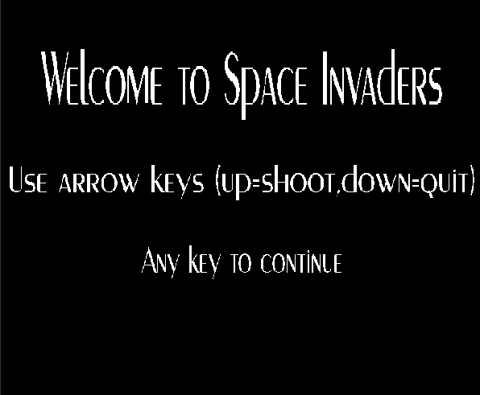
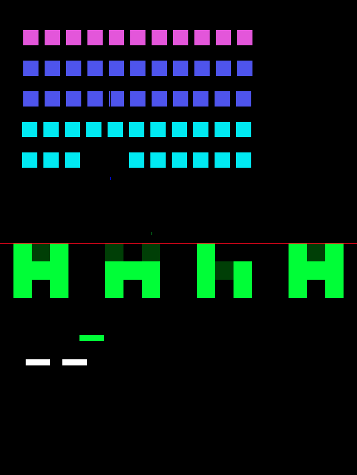

# SpaceInvadersV0

A model-driven implementation of a simplified **Space Invaders** game built with **UML-RT / Art** and generated C++ runtime code. The project models the game as a set of communicating state-based capsules, including the player, enemies, bullets, bunkers, and coordination logic for enemy movement.

The system demonstrates how reactive game behavior can be expressed at the model level and then executed through generated target code. Core gameplay includes player movement and shooting, coordinated enemy movement across the formation, probabilistic enemy firing, collision handling, and win/loss conditions.

## Features

- **Model-driven game logic** using UML-RT / Art capsules and protocols
- **Player controls** for movement and shooting
- **Coordinated enemy formation movement**
  - horizontal sweeps
  - directional reversal at borders
  - downward progression between sweeps
- **Enemy shooting** with probabilistic firing behavior
- **Collision handling** for bullets, bunkers, enemies, and player
- **Win/loss conditions** based on enemy elimination or formation reaching the lower boundary
- **Sequence-diagram documentation** for a separate communicating-pipeline example included as part of the broader project work

## Project Structure

- `Top.art` — top-level coordination and rendering control
- `Player.art` — player behavior and shooting
- `PlayerBullet.art` — player bullet behavior
- `Enemy.art` — individual enemy movement, rendering, and shooting
- `EnemyHarness.art` — coordination of the full enemy formation
- `EnemyBullet.art` — enemy bullet behavior
- `Bunker.art` — bunker state and hit handling
- `ReadMe.txt` — project notes from development
- `Part2.png` — sequence diagram for a related communicating-component example
- `docs/` — screenshots and documentation assets

## Images

### Intro screen


### Gameplay


## Running the Project

Open a terminal in the `SpaceInvadersV0` folder and run:

```bash
./rebuild_run.sh
